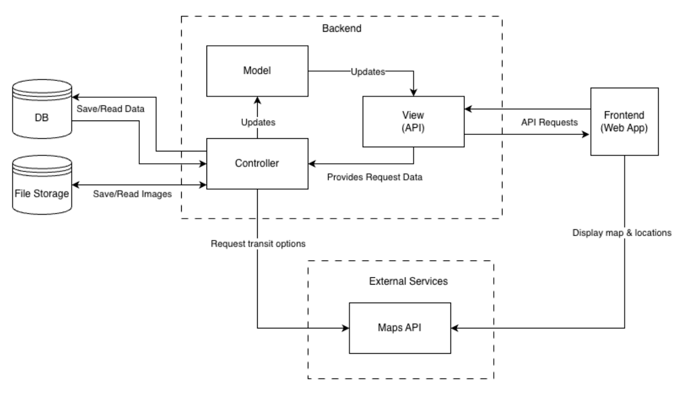
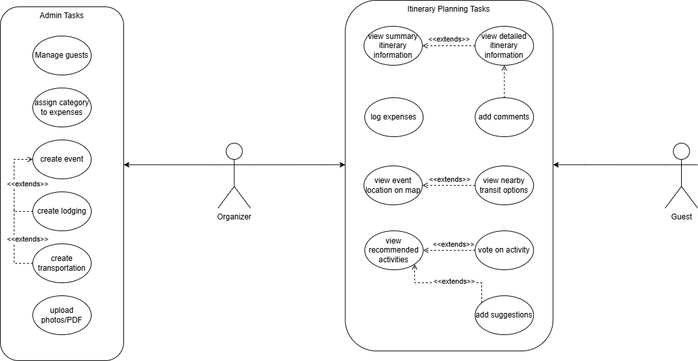

# Trip Itinerary Planner Design Documentation

## Team Information

* Team name:   
  * Lost Travelers  
* Team members  
  * Ryan Yocum  
  * Reid Taylor  
  * Hiroto Takeuchi  
  * Avi Rathod

## Executive Summary

Traveling with a group of friends or a social club is always fun, but planning a trip, keeping up with, and communicating plans in the moment can be stressful and affect travelers’ enjoyment. The Trip Itinerary Planner solves this by providing an easy way for travelers to build a trip plan, and to view events, times, tickets, and other relevant information in one place on the go. The Tracker divides users into two categories: Organizer and Guest. Organizers are responsible for managing trip party members and assembling or updating a trip plan. Guests can suggest trip details and modifications, as well as age and input dietary restrictions.

## Requirements

This section describes the features of the application.

### Definition of MVP

The Minimal Viable Product for this application is considered complete when the application serves its core purpose to its user base. For this project, that includes completing the Epics and stories defined below.

### MVP Features

Epic: Expense Sharing

* As a user, I want to log expenses (food, transport, attractions) and assign them to specific categories, so that I can track my spending against my vacation budget.  
* As an organizer, I want to record who paid for what and split costs among the party, so that we can settle up fairly at the end of the trip without arguing over who owes what.  
* As a guest, I want to see a running balance of who owes whom, so that we can easily square up debts before we leave.

Epic: Booking Management

* As a user, I want to upload photos or PDFs of my tickets (plane, train, museum) and attach them to the specific event, so that I don't have to dig through my email to find them at the gate.  
* As a user, I want to see a quick summary of all booking reference numbers and customer service numbers, so that I can easily call for help if a flight is delayed.  
* As a user, I want to see all my event locations plotted on a map, so that I can visualize where everything is in relation to my hotel.  
* As a guest, I want to be able to view the trip plans on a high level including flights, meal locations, and lodging plans, so I can know the itinerary for the trip.

Epic: Group Management

* As an organizer, I want to invite my travel companions to collaborate on the itinerary at the same time, so that everyone can vote on activities, add their own suggestions, and feel involved in the planning process.  
* As an organizer, I want to be able to manage, add, delete, and modify group members, so that I know who is participating in a trip.  
* As a guest, I want to be able to add a comment on a trip item, so that I can share my ideas and opinions.

Epic: Recommendations

* As a user, I want to see nearby transit options relative to my current event, so that I can navigate the city more easily.  
* As an organizer, I want to input my destination and receive recommendations for popular restaurants or attractions near my existing itinerary, so that I can fill gaps in my schedule.

## Architecture and Design

### Software Architecture

Our system uses a Model-View-Controller architecture at its core, which provides clear separation between data and behaviors. Our frontend web app sends requests to the View tier of the backend, which provides an interface to interact with the business logic and data. Both the frontend and backend connect to an external map service to render trip locations and to get recommendations, respectively. Our system also connects to a main database, as well as a file storage server for images.

### Use Cases

Our application has two types of users: Organizers (Admins) and Guests. One travel group has at least one organizer and any number of guests. The organizer is the “admin” of the group and has all the permissions of the guest. Both users fall under the category “traveler.” The organizer has the power to add and remove guests and also has the final say in planning details.

